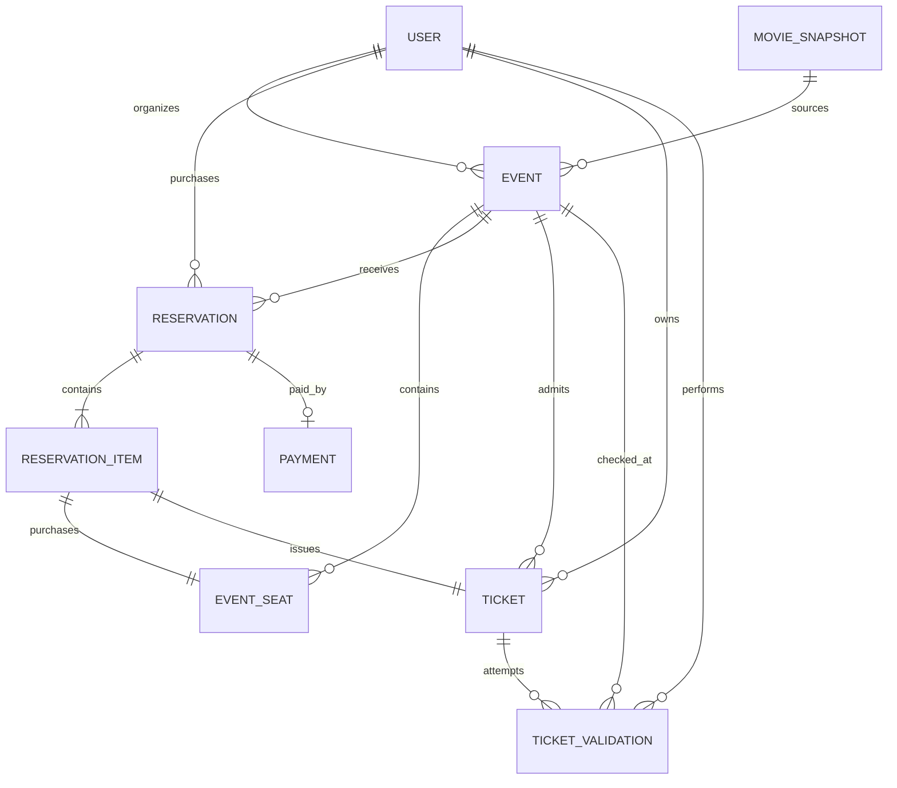

# Modelo de Domínio

## 1. Vocabulário do domínio

### Filme do catálogo
Um filme da TMDb usado como material de origem. Ele não é, por si só, um evento vendável.

### Evento / Sessão
Uma sessão local criada por um organizador a partir de um filme do catálogo, com horário, local, sala, preço e estoque de assentos próprios.

### Assento do evento
A identidade de um assento físico restrita a um evento/sessão.

### Reserva
O registro persistente que agrupa os assentos comprados por um cliente para um evento.

### Item da reserva
Uma linha da reserva representando uma unidade de assento/preço.

### Pagamento
O resultado do simulador associado a uma tentativa de compra/reserva bem-sucedida, dependendo do detalhe de implementação.

### Ingresso
A credencial de entrada emitida para um assento comprado com sucesso.

### Validação de ingresso
Um registro de auditoria/resultado de uma tentativa de validação na portaria.

---

## 2. Entidades propostas

Esta é uma proposta de domínio, não um schema Prisma congelado. A nomenclatura dos campos pode mudar desde que a semântica seja preservada.

### User

```text
id
name
email
role: ORGANIZER | CUSTOMER | GATE
createdAt
updatedAt
```

O Better Auth pode possuir/adicionar os modelos/campos necessários de usuário/sessão/conta. O código da aplicação deve normalizá-los por meio do adapter de auth.

### MovieSnapshot

Opção A: modelo dedicado. Opção B: campos de snapshot diretamente em `Event`. Um modelo dedicado é útil se várias sessões reutilizarem o mesmo snapshot local sem nova busca externa.

```text
id
source: TMDB
externalId
originalTitle?
title
overview?
posterPath/posterUrl?
backdropPath/backdropUrl?
releaseDate?
createdAt
```

Unicidade recomendada:

```text
UNIQUE(source, externalId)
```

### Event

```text
id
organizerId
movieSnapshotId
status: DRAFT | PUBLISHED | CANCELLED
venueName
roomName
startsAt
priceCents
currency
rows
seatsPerRow
capacity
publishedAt?
createdAt
updatedAt
```

Observações:

- `capacity` deve ser igual à quantidade de assentos gerados, a menos que no futuro seja implementado bloqueio/desativação de assentos.
- armazenar valores monetários em unidades menores inteiras (`priceCents`), e não em ponto flutuante.
- o título do evento pode ser derivado do título do snapshot ou persistido caso seja desejado um nome customizado.

### EventSeat

```text
id
eventId
rowLabel
seatNumber
label
status: AVAILABLE | SOLD
createdAt
updatedAt
```

Constraint crítica:

```text
UNIQUE(eventId, rowLabel, seatNumber)
```

ou constraint única equivalente por evento/rótulo.

### Reservation

```text
id
customerId
eventId
status: CONFIRMED | FAILED? / PENDING se necessário internamente
subtotalCents
totalCents
createdAt
updatedAt
```

Para a V1 mais simples, somente reservas confirmadas e persistentes precisam permanecer após uma transação bem-sucedida; tentativas recusadas podem ser representadas principalmente por `PaymentAttempt`/`Payment`, se desejado.

### ReservationItem

```text
id
reservationId
eventSeatId
unitPriceCents
createdAt
```

A unicidade crítica deve tornar impossível que um assento pertença a múltiplos itens de reserva bem-sucedidos, por exemplo:

```text
UNIQUE(eventSeatId)
```

Isso funciona como uma segunda proteção de integridade, além do status do assento/aquisição atômica.

### Payment

```text
id
reservationId?
customerId
eventId
status: APPROVED | DECLINED
amountCents
provider: SIMULATOR
reference
createdAt
```

A relação exata com uma reserva para tentativas recusadas pode ser decidida durante a implementação do schema. O comportamento importante do produto é permitir auditoria determinística sem dados financeiros reais.

### Ticket

```text
id
reservationItemId
eventId
customerId
eventSeatId
validationTokenHash
manualCode
shareTokenHash?
usedAt?
createdAt
```

Constraints:

```text
UNIQUE(reservationItemId)
UNIQUE(validationTokenHash)
UNIQUE(manualCode)
UNIQUE(shareTokenHash) quando não nulo / equivalente suportado
```

### TicketValidation

```text
id
ticketId?
eventId
gateUserId
result: VALID | INVALID | ALREADY_USED | WRONG_EVENT
validatedAt
```

Para um token desconhecido `INVALID`, pode não existir `ticketId`. Não persistir segredos brutos de QR inválido sem necessidade.

---

## 3. Relacionamentos



---

## 4. Máquinas de estado

### Event

```text
DRAFT
  |
  | publicar (configuração válida)
  v
PUBLISHED
  |
  | caminho opcional de cancelamento
  v
CANCELLED
```

Não implementar complexidade de republicação/cancelamento a menos que o comportamento escolhido seja definido explicitamente.

### EventSeat

```text
AVAILABLE
   |
   | checkout atômico bem-sucedido
   v
SOLD
```

Sem estado `HELD` na V1.

### Payment

```text
(requisição ao simulador)
      |          |
      v          v
  APPROVED    DECLINED
```

Se um estado interno transitório `PENDING` for introduzido, ele não deve resultar em lock persistente de reserva sem limite de tempo.

### Ticket

A usabilidade do ingresso pode ser derivada de campos, em vez de um enum:

```text
usedAt = null   -> potencialmente ACTIVE
usedAt != null  -> USED
```

Se o cancelamento de evento se tornar uma funcionalidade no futuro, a elegibilidade também dependerá do estado de cancelamento do evento/ingresso.

---

## 5. Invariantes do domínio

Estes itens são mais importantes do que os nomes exatos das tabelas.

### INV-001 — separação de papéis
Somente `ORGANIZER` cria/gerencia eventos, somente `CUSTOMER` realiza checkout de ingressos de cliente e somente `GATE` consome ingressos.

### INV-002 — propriedade do organizador
Um organizador não pode atualizar/publicar o evento de outro organizador.

### INV-003 — identidade do assento do evento
Dentro de um evento, um rótulo físico corresponde a um único `EventSeat`.

### INV-004 — sem venda duplicada
Um `EventSeat` pode ser comprado com sucesso no máximo uma vez.

### INV-005 — compra atômica de múltiplos assentos
Uma solicitação dos assentos `[A1, A2]` não pode concluir um checkout completo se apenas um dos assentos solicitados tiver sido adquirido. A transação deve cumprir o contrato da compra por inteiro ou retornar conflito de acordo com a semântica de checkout escolhida.

### INV-006 — pagamento recusado não emite ingresso válido
Um resultado `DECLINED` do simulador nunca cria uma credencial de entrada que possa ser validada.

### INV-007 — um ingresso por assento comprado
Cada item de reserva confirmado resulta em exatamente um ingresso.

### INV-008 — credencial não forjável
A validade do ingresso se baseia na consulta de uma credencial opaca de alta entropia/código manual, e não em IDs de ingresso fornecidos pelo cliente ou dados estruturados sem assinatura.

### INV-009 — compartilhar != transferir
Um token de compartilhamento concede acesso de apresentação/visualização, mas não altera `customerId`.

### INV-010 — entrada de uso único
Um ingresso pode fazer a transição de não utilizado para utilizado exatamente uma vez.

### INV-011 — evento errado não consome
Apresentar um ingresso genuíno e não utilizado no evento errado retorna `WRONG_EVENT` e não deve definir `usedAt`.

### INV-012 — credencial desconhecida não consome
Um token/código manual inválido não causa efeito em nenhum ingresso válido.

### INV-013 — eventos criados sobrevivem à indisponibilidade da TMDb
Renderizar/comprar um evento existente não exige uma requisição ao vivo para a TMDb.

---

## 6. Estratégias de aquisição de assentos

A implementação pode usar operações transacionais do Prisma e/ou SQL bruto cuidadosamente limitado se as operações geradas pelo Prisma não conseguirem expressar de forma clara o update condicional necessário.

O requisito é o comportamento, não pureza de ORM.

Aquisição conceitual:

```sql
UPDATE event_seat
SET status = 'SOLD'
WHERE id IN (...requested ids...)
  AND event_id = :eventId
  AND status = 'AVAILABLE';
```

A implementação deve verificar se todos os assentos solicitados foram adquiridos. Caso contrário, deve fazer rollback da transação de checkout e retornar `SEAT_UNAVAILABLE`.

Um design orientado por constraints alternativo é aceitável se o comportamento sob concorrência for testado e documentado.

---

## 7. Dinheiro e tempo

### Dinheiro

Persistir valores monetários como centavos/unidades menores inteiras.

Exemplo:

```text
R$ 35,00 -> 3500
```

Formatar apenas nas fronteiras de UI.

### Tempo

Persistir timestamps de eventos de forma consistente (preferencialmente com comportamento de timestamp compatível com UTC no banco) e exibir usando o locale/fuso horário pretendido pela aplicação. O README deve declarar o comportamento de fuso horário escolhido para o desafio para evitar confusão durante a avaliação.
