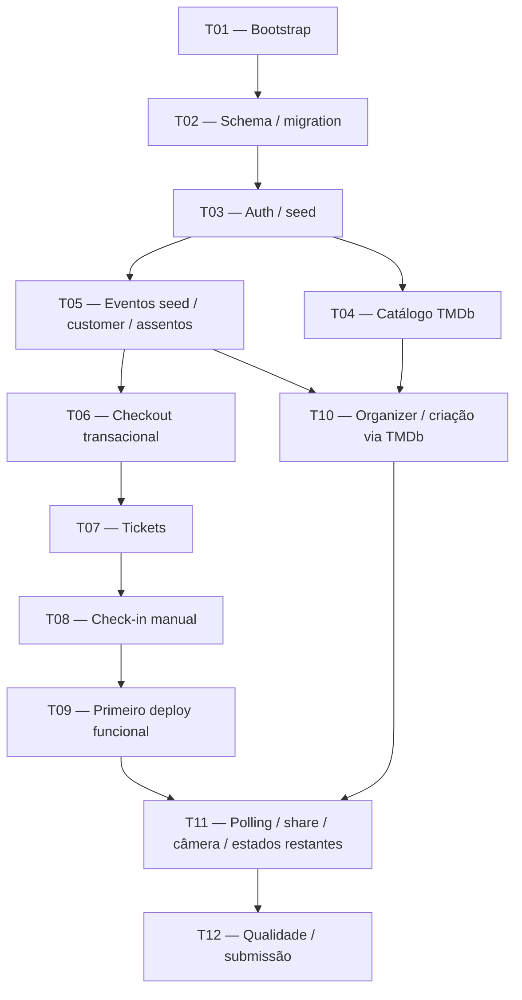

# Plano Definitivo de Implementação — Projeção Tickets

> **Estado final:** todas as etapas T01–T12 foram concluídas. O conteúdo abaixo é mantido como histórico do plano aprovado, das decisões e dos gates usados na entrega.

| Etapas | Estado final |
|---|---|
| T01–T03 | Bootstrap, schema, autenticação e seed concluídos. |
| T04–T08 | Catálogo, eventos, checkout, tickets e check-in concluídos. |
| T09–T12 | Deploy inicial, organizer, polling/share/câmera e qualidade concluídos. |

## 1. Avaliação do estado atual do repositório

O repositório contém a especificação funcional, arquitetural, visual, critérios de aceite, matriz de rastreabilidade, referências de design e assets aprovados. Ainda não existe aplicação executável:

- não há `package.json`, lockfile, código em `src/`, schema Prisma, migrations, seed, testes, CI ou configuração de deploy;
- a branch está limpa e os commits atuais representam apenas documentação, design e preparação operacional;
- `.env.local` está ignorado e contém somente as variáveis já conhecidas, sem necessidade de revelar seus valores;
- a variável `TICKET_CREDENTIAL_ENCRYPTION_KEY` ainda precisa ser adicionada na implementação;
- o asset existente `public/brand/opengraphimage.png` diverge do nome documentado `public/brand/opengraph-image.jpg`; o nome documentado será adotado no bootstrap;
- não há código legado a migrar: a implementação começa como greenfield, mas com escopo e decisões já definidos.

## 2. Resultado da auditoria documental

As especificações formam uma base coerente para um monólito modular Next.js, com três experiências distintas:

- cliente: descoberta, assentos, checkout e ingressos;
- organizador: catálogo TMDb e gestão de sessões;
- portaria: validação rápida por QR ou código manual.

A ordem de precedência será:

1. produto, funcional, arquitetura, domínio, API, aceite, ADRs e segurança;
2. decisões refinadas e explicitamente aprovadas neste plano;
3. design Markdown;
4. mockups PNG como referência visual e de interação.

O MVP permanece centrado no fluxo completo de uma sessão de cinema, com prioridade para integridade de assentos, autorização, pagamento determinístico, credenciais seguras e check-in de uso único.

## 3. Contradições ou questões abertas

As ambiguidades identificadas estão resolvidas:

- uma compra com vários assentos gera um `Ticket` para cada `ReservationItem`; mockups com um único QR cobrindo vários assentos serão adaptados;
- taxas, meia-entrada, tipos de ingresso, CPF/documento, relatórios, analytics, configurações genéricas, recuperação de senha e liberação manual sem ingresso serão removidos ou reescritos;
- o MVP modelará apenas `DRAFT` e `PUBLISHED`; `CANCELLED`, cancelamento e reembolso não serão implementados;
- eventos `PUBLISHED` serão imutáveis; somente `DRAFT` poderá ser editado;
- a reexibição futura do QR será resolvida por hash para lookup mais cópia criptografada do token;
- versões numéricas de Node, Next.js, Prisma e bibliotecas serão escolhidas e fixadas durante T01, não tratadas como decisões permanentes de produto;
- o primeiro deploy não dependerá de TMDb;
- o nome canônico do asset Open Graph será `public/brand/opengraph-image.jpg`.

Não resta conflito documental que exija decisão prévia adicional.

## 4. Bloqueadores

Não existe bloqueador para iniciar a implementação.

Existem apenas pré-requisitos operacionais para etapas posteriores:

- gerar uma `TICKET_CREDENTIAL_ENCRYPTION_KEY` segura para cada ambiente;
- disponibilizar projeto PostgreSQL Neon e projeto Vercel antes de T09;
- configurar domínio/URL definitiva para Better Auth no primeiro deploy;
- fornecer `TMDB_ACCESS_TOKEN` antes de concluir T04/T10 e o deploy final.

Neon MCP, Neon CLI e Vercel CLI não são requisitos. Configuração manual pelos painéis ou CLIs escolhidas durante a execução é suficiente.

## 5. Pontos não bloqueantes

- A câmera precisa de HTTPS ou contexto seguro; o código manual garante demonstração mesmo sem câmera.
- O primeiro deploy pode omitir `TMDB_ACCESS_TOKEN` se T04 ainda não estiver concluída.
- A rotação da chave de criptografia de tickets fica como hardening futuro; o MVP usa uma única chave por ambiente.
- Playwright poderá usar a validação manual nos ambientes em que automação de câmera não seja confiável.
- Cold start do banco, latência de TMDb e permissões de câmera devem gerar estados compreensíveis, sem ampliar a infraestrutura.
- Não serão adicionados Redis, filas, locks distribuídos, microservices ou funcionalidades específicas do Neon.

## 6. Riscos técnicos principais

- **Venda duplicada:** mitigada por transação, lock pessimista ordenado, update condicional, constraints, contagem de linhas afetadas e testes concorrentes reais.
- **Deadlock em checkout multi-seat:** mitigado adquirindo locks sempre pela mesma ordenação determinística de IDs.
- **Compra parcial:** qualquer divergência no conjunto solicitado provoca rollback integral.
- **Check-in duplo:** mitigado por compare-and-set atômico sobre `usedAt`.
- **Consumo no evento errado:** a condição de evento participa da atualização; `WRONG_EVENT` nunca altera o ticket.
- **Perda da chave de tickets:** impediria reexibir credenciais criptografadas existentes; a chave deve ser persistida com backup operacional e nunca regenerada automaticamente em produção.
- **Exposição de credenciais:** tokens brutos, hashes, ciphertext, IV, auth tag, cookies, cartões e segredos não entram em logs.
- **Auth dependente de versão:** integração, desativação de signup, cookies e trusted origins serão validados contra a documentação da versão efetivamente pinada.
- **Deploy tardio:** mitigado por T09 imediatamente após o vertical slice seed-based.
- **Dependência externa:** eventos persistidos usam snapshot local e continuam funcionando sem TMDb.

## 7. Estratégia geral de implementação

A implementação seguirá fatias verticais pequenas, sempre preservando limites de módulo:

- Route Handlers validam HTTP, autenticação e DTOs, delegando para `src/modules/**`;
- componentes React cuidam de apresentação e interação, sem regras transacionais;
- serviços de domínio orquestram casos de uso;
- repositórios encapsulam Prisma e qualquer SQL PostgreSQL específico;
- erros internos são convertidos em códigos estáveis da aplicação;
- tipos da TMDb, Better Auth, Prisma e bibliotecas de câmera não vazam para outros módulos.

Interfaces públicas principais:

- auth: `getSession`, `requireUser`, `requireRole`, `requireOwner`;
- catálogo: `searchMovies`, `getMovieDetails`, `getMovieVideos`;
- checkout: sucesso, `402 PAYMENT_DECLINED` ou `409 SEAT_UNAVAILABLE`;
- check-in: HTTP 200 com `VALID`, `INVALID`, `ALREADY_USED` ou `WRONG_EVENT`;
- compartilhamento: cada `POST` gera novo token, invalida o anterior e retorna o novo link;
- erros: `{ "error": { "code", "message", "details"? } }`.

Configuração planejada:

```text
APPLICATION
APP_URL

DATABASE
DATABASE_URL
DIRECT_URL
TEST_DATABASE_URL

AUTH
BETTER_AUTH_SECRET
BETTER_AUTH_URL

TMDb
TMDB_ACCESS_TOKEN

TICKET SECURITY
TICKET_CREDENTIAL_ENCRYPTION_KEY
```

O futuro `.env.example` conterá apenas placeholders seguros. `TICKET_CREDENTIAL_ENCRYPTION_KEY` será uma representação Base64 de exatamente 32 bytes aleatórios, validada no servidor.

## 8. Vertical slice proposto

O primeiro vertical slice será integralmente baseado em seed:

```text
schema
→ migration
→ usuários seed
→ auth
→ snapshot/evento publicado seed
→ descoberta do cliente
→ seleção inicial de assentos
→ checkout aprovado
→ emissão de um ticket por assento
→ exibição de QR/código manual
→ check-in manual VALID
→ repetição ALREADY_USED
```

O seed criará, sem chamar a TMDb:

- um organizador;
- dois clientes;
- um usuário de portaria;
- pelo menos dois eventos futuros publicados;
- snapshots locais dos filmes;
- assentos disponíveis.

Credenciais sugeridas para o avaliador:

```text
organizador@projecao.local
cliente1@projecao.local
cliente2@projecao.local
portaria@projecao.local

Senha comum de demonstração: ProjecaoDemo2026!
```

O primeiro deploy será desbloqueado por T08. T04/TMDb não participará desse gate.

## 9. Fases / milestones

| Milestone | Entrega | Tarefas | Gate |
|---|---|---|---|
| M0 | Plano definitivo persistido e rastreabilidade preparada | documentação inicial | Plano aprovado |
| M1 | Fundação executável | T01–T03 | lint, tipos, testes básicos, build, migration e login |
| M2 | Vertical slice seed-based | T05–T08 | compra, ticket, `VALID`, `ALREADY_USED` |
| M3 | Primeiro deploy funcional | T09 | Vercel/Neon/Auth/runtime validados |
| M4 | Catálogo e organizador | T04 + T10 | criação e publicação via TMDb |
| M5 | MVP funcional completo | T11 | share, polling, câmera e todos os estados |
| M6 | Qualidade e documentação | T12 | suíte, acessibilidade, segurança e README |
| M7 | Deploy final e submissão | release de T12 | todos os gates finais aprovados |

T04 pode avançar em paralelo a M2/M3 assim que T03 estiver concluída.

## 10. Breakdown detalhado de tarefas

### T01 — Bootstrap

**Objetivo:** criar a base executável, scripts, validação de ambiente e sistema visual.

**Áreas:** manifestos/configurações, `src/app`, `src/lib/env`, estilos, Compose, `.env.example` e CI.

**Dependências:** nenhuma.

**Implementação:**

- usar pnpm e piná-lo em `packageManager`;
- selecionar versões estáveis e compatíveis no momento da execução;
- confirmar em documentação oficial qualquer integração sensível à versão;
- fixar versões e resolução final no lockfile;
- configurar TypeScript estrito, ESLint, Tailwind, aliases e scripts;
- configurar lint, typecheck, testes, E2E e build;
- validar variáveis server-only sem expô-las ao bundle do cliente;
- adicionar as oito variáveis planejadas ao `.env.example`;
- validar a chave de ticket como Base64 de 32 bytes;
- adotar os assets aprovados e corrigir o nome do Open Graph;
- configurar primitives, tokens, fontes e shells responsivos do design aprovado.

Node, Next.js, Prisma e versões de bibliotecas escolhidas aqui tornam-se baseline do repositório, mas não invariantes arquiteturais permanentes.

**Validação:** instalação limpa, lint, typecheck, teste mínimo e `next build`.

**Definição de pronto:** aplicação inicia, scripts funcionam, nenhuma chave real está versionada e o shell visual básico é responsivo.

**Documentação/commit:** atualizar referências version-sensitive; `chore: inicializar aplicação e toolchain`.

### T02 — Schema / migration

**Objetivo:** criar o schema PostgreSQL, migration inicial e acesso centralizado ao banco.

**Áreas:** `prisma/`, `src/lib/db` e testes de schema.

**Dependências:** T01.

**Implementação:**

- modelos de Better Auth conforme a versão escolhida;
- `User` com `ORGANIZER | CUSTOMER | GATE`;
- `MovieSnapshot`, `Event`, `EventSeat`, `Reservation`, `ReservationItem`, `Payment`, `Ticket` e `TicketValidation`;
- `EventStatus`: apenas `DRAFT | PUBLISHED`;
- `EventSeatStatus`: `AVAILABLE | SOLD`;
- `PaymentStatus`: `APPROVED | DECLINED`;
- timestamps PostgreSQL compatíveis com UTC e apresentação em `America/Sao_Paulo`;
- dinheiro em centavos inteiros e moeda `BRL`;
- `Payment.reservationId` opcional para recusas;
- campos de hash, ciphertext, IV e auth tag no ticket;
- constraints únicas para assento por evento, item por assento, ticket por item, hashes e códigos;
- dimensões: 1–20 fileiras, 1–30 lugares por fileira e máximo de 600 assentos;
- cliente Prisma reutilizado de forma compatível com Next.js;
- `DATABASE_URL` para runtime, `DIRECT_URL` para tooling e `TEST_DATABASE_URL` para testes.

**Validação:** aplicar migration em PostgreSQL local limpo, inspecionar constraints e executar teste de conexão.

**Definição de pronto:** banco novo pode ser criado somente pelas migrations versionadas e o schema impede duplicidades estruturais críticas.

**Documentação/commit:** registrar modelo efetivo; `feat: criar schema inicial e migrations`.

### T03 — Auth / seed

**Objetivo:** implementar Better Auth isolado, login, papéis e seed de usuários.

**Áreas:** `src/modules/auth`, rota mínima de integração, login e `prisma/seed`.

**Dependências:** T02.

**Implementação:**

- único entry point público em `src/modules/auth/index.ts`;
- normalizar sessão e usuário em tipos da aplicação;
- implementar `getSession`, `requireUser`, `requireRole` e `requireOwner`;
- limitar imports de `better-auth` ao módulo autorizado via ESLint;
- configurar e-mail/senha, cookies, URLs e trusted origins;
- desativar signup no servidor usando a API real da versão escolhida;
- não criar página nem endpoint público de cadastro da aplicação;
- criar usuários seed pelas APIs suportadas do auth e atribuir papéis;
- tornar o seed repetível por e-mails/identificadores estáveis;
- proteger servidor, Route Handlers e páginas; Proxy/middleware pode melhorar UX, mas não substitui autorização.

**Validação:** login/logout, sessão expirada, signup direto rejeitado, 401 sem sessão, 403 por papel e testes de propriedade.

**Definição de pronto:** somente contas seed entram no sistema e nenhuma rota confia em papel vindo do cliente.

**Documentação/commit:** documentar contas demo e auth; `feat: implementar autenticação e usuários seed`.

### T04 — Catálogo TMDb

**Objetivo:** implementar o boundary server-side de catálogo sem bloquear T09.

**Áreas:** `src/modules/catalog` e `/api/catalog/**`.

**Dependências:** T03.

**Implementação:**

- `searchMovies(query)`;
- `getMovieDetails(movieId)`;
- `getMovieVideos(movieId)`;
- DTOs pertencentes à aplicação;
- token somente no servidor;
- timeout e mapeamento seguro para `CATALOG_UNAVAILABLE`;
- escolha determinística de trailer suportado, com `trailer: null` como sucesso;
- endpoints restritos a `ORGANIZER`;
- poster ausente usa o placeholder aprovado;
- testes usam respostas TMDb mockadas, sem depender da rede.

**Validação:** busca, detalhes, trailer, ausência de trailer, erro externo e tentativa por papel incorreto.

**Definição de pronto:** nenhum tipo ou segredo da TMDb vaza para browser ou módulos de domínio.

**Documentação/commit:** registrar DTOs e limitações; `feat: integrar catálogo TMDb no servidor`.

### T05 — Eventos seed / customer / assentos

**Objetivo:** disponibilizar eventos publicados seed para descoberta e seleção inicial de assentos.

**Áreas:** módulos de eventos/assentos, páginas públicas e seed.

**Dependências:** T03.

**Implementação:**

- criar snapshots e eventos futuros diretamente pelo seed, sem chamada TMDb;
- criar pelo menos dois eventos publicados para permitir testes de evento errado;
- gerar `EventSeat` com rótulos determinísticos `A1...`;
- implementar busca pública básica por título;
- expor somente eventos futuros `PUBLISHED`;
- implementar detalhe, preço, data/local e disponibilidade;
- criar mapa acessível com `AVAILABLE`, `SOLD` e `SELECTED` local;
- manter logística da sessão acima da decoração visual;
- transportar seleção para checkout sem prometer hold;
- deixar polling periódico para T11.

**Validação:** evento draft invisível, busca, detalhe, assento de outro evento rejeitado, mapa por teclado e seed em banco limpo.

**Definição de pronto:** cliente autenticado consegue descobrir um evento seed, escolher assentos e iniciar checkout.

**Documentação/commit:** documentar seed offline; `feat: adicionar eventos seed e seleção de assentos`.

### T06 — Checkout transacional

**Objetivo:** implementar pagamento simulado e compra atômica com um ticket por assento.

**Áreas:** módulos de checkout, payments, reservations, persistência de assentos e emissão interna de tickets.

**Dependências:** T05.

**Implementação:**

- valores determinísticos sugeridos:
  - aprovado: `4242 4242 4242 4242`;
  - recusado: `4000 0000 0000 0002`;
- validade futura e CVV apenas validados transitoriamente;
- servidor recalcula quantidade e total a partir do evento;
- recusa persiste `Payment(status=DECLINED, reservationId=null)` e retorna HTTP 402 `PAYMENT_DECLINED`;
- recusa não obtém lock de assento, não cria reserva/ticket e não altera estoque;
- aprovação abre uma transação curta;
- assentos são deduplicados, validados e ordenados por ID;
- obter locks `FOR UPDATE` em ordem determinística;
- verificar evento, pertencimento e estado `AVAILABLE`;
- executar update condicional e conferir a quantidade afetada;
- criar `Reservation`, itens, `Payment(APPROVED)` e um `Ticket` por item;
- gerar credenciais dos tickets dentro do fluxo transacional;
- qualquer divergência retorna 409 `SEAT_UNAVAILABLE` e desfaz tudo.

Se o Prisma Client pinado não oferecer uma abstração real para o lock necessário, usar SQL PostgreSQL parametrizado por `$queryRaw` ou API segura equivalente, exclusivamente no repositório de checkout. Não interpolar input, não inventar API do Prisma e não espalhar SQL em rotas ou componentes.

**Validação:** aprovado, recusado, assentos repetidos, assento de outro evento, evento não publicado, multi-seat parcial e duas compras realmente concorrentes.

**Definição de pronto:** exatamente uma compra vence uma disputa e nenhuma combinação de falha produz ticket utilizável ou compra parcial.

**Documentação/commit:** registrar códigos e estratégia SQL; `feat: implementar checkout transacional e simulador`.

### T07 — Tickets

**Objetivo:** disponibilizar os ingressos emitidos com QR recuperável e apresentação privada.

**Áreas:** módulo de tickets, primitives criptográficas e páginas/API de ingressos.

**Dependências:** T06.

**Implementação:**

- gerar validation token com CSPRNG, 32 bytes e Base64URL;
- armazenar SHA-256 em formato canônico para lookup;
- criptografar a cópia recuperável com AES-256-GCM;
- usar IV aleatório de 12 bytes e auth tag da API criptográfica;
- persistir ciphertext, IV, auth tag e versão do formato, sem expô-los;
- a chave não gera tokens e não substitui sua aleatoriedade individual;
- gerar código manual separado com 12 caracteres Crockford, armazenar canônico e renderizar em grupos;
- listar apenas tickets do cliente autenticado;
- detalhe exige propriedade e descriptografa somente na fronteira autorizada;
- renderizar QR com a credencial opaca, nunca com ID previsível;
- não expor hash, chave ou metadata criptográfica;
- tratar falha de autenticação GCM como erro interno seguro;
- compartilhamento fica para T11.

Fluxo aprovado:

```text
raw validation token
├─ SHA-256 → lookup/validação
└─ AES-256-GCM → persistência recuperável para reexibir o QR
```

**Validação:** round-trip criptográfico, chave inválida, ciphertext adulterado, propriedade, serialização segura e um ticket por item.

**Definição de pronto:** cliente reabre o ingresso posteriormente e vê QR/código sem qualquer segredo interno da persistência.

**Documentação/commit:** registrar gestão da chave; `feat: emitir e apresentar ingressos seguros`.

### T08 — Check-in manual

**Objetivo:** fechar o vertical slice com validação manual e consumo atômico.

**Áreas:** módulo de check-in, endpoints e shell da portaria.

**Dependências:** T07.

**Implementação:**

- selecionar evento publicado;
- normalizar código manual antes do lookup;
- hash do token QR antes do lookup;
- nunca pesquisar por ID fornecido como credencial;
- `INVALID`: registrar tentativa sem token bruto e sem alterar ticket;
- `WRONG_EVENT`: registrar resultado e não consumir;
- consumo válido usa update condicional `usedAt IS NULL AND eventId = selectedEvent`;
- exatamente uma linha afetada significa `VALID`;
- zero linhas após ticket conhecido no evento correto significa `ALREADY_USED`;
- preservar o primeiro `usedAt`;
- registrar `TicketValidation`;
- retornar resultados esperados com HTTP 200;
- implementar UI manual completa para `VALID` e `ALREADY_USED`;
- preparar semântica backend para os quatro resultados; refinamento visual e câmera ficam em T11.

**Validação:** válido, repetido, inválido, evento errado e duas validações concorrentes com um único `VALID`.

**Definição de pronto:** o fluxo seed-based compra um ingresso, retorna `VALID` e depois `ALREADY_USED`.

**Documentação/commit:** registrar algoritmo de consumo; `feat: implementar check-in manual atômico`.

### T09 — Primeiro deploy funcional

**Objetivo:** descobrir cedo problemas de Vercel, Neon, Better Auth, migrations e runtime.

**Áreas:** configuração de deploy, variáveis, migration/seed operacional e smoke test.

**Dependências:** somente T08.

**Implementação:**

- executar lint, typecheck, testes aplicáveis e `next build`;
- criar/configurar o PostgreSQL Neon;
- usar `DATABASE_URL` de runtime e `DIRECT_URL` para migration/tooling;
- configurar Vercel, `APP_URL`, `BETTER_AUTH_URL`, origins e segredos;
- executar `migrate deploy` como etapa controlada, nunca em `next build`;
- executar seed explicitamente;
- validar cliente e portaria em produção;
- testar evento seed, checkout, ticket e check-in manual;
- testar TMDb apenas se T04 já estiver concluída.

A documentação do Neon recomenda conexão pooled para aplicações/serverless e direta para migrations ou operações dependentes de sessão; T01 deve ainda confirmar a configuração exata da versão pinada do Prisma. [Neon — Connection pooling](https://neon.com/docs/connect/connection-pooling)

**Validação:** smoke test descrito na seção 18.

**Definição de pronto:** vertical slice funciona no deploy sem depender da TMDb.

**Documentação/commit:** registrar URL e procedimento; `chore: configurar primeiro deploy funcional`.

#### Registro de execução — 11/08/2026

- produção publicada em `https://projecao-tickets.vercel.app`;
- Neon configurado como provider PostgreSQL, sem acoplamento no domínio;
- `prisma migrate deploy` executado explicitamente via `DIRECT_URL` direta e confirmado sem migrations pendentes;
- seed executado explicitamente após a migration;
- runtime Vercel configurado com `DATABASE_URL` pooled; `TEST_DATABASE_URL` não é configurada em produção;
- `APP_URL` e `BETTER_AUTH_URL` usam a URL HTTPS canônica e o smoke confirmou cookies, login e logout;
- smoke seed-based confirmou descoberta, checkout aprovado/recusado, ticket/QR/código e `VALID` → `ALREADY_USED`.

### T10 — Organizer / criação via TMDb

**Objetivo:** implementar criação, edição de drafts e publicação pelo organizador.

**Áreas:** módulo de eventos, páginas/rotas do organizador e modal TMDb.

**Dependências:** T04 e T05.

**Implementação:**

- listar somente eventos do organizador autenticado;
- buscar e selecionar filme via módulo de catálogo;
- modal com detalhes, trailer ou fallback não bloqueante;
- criar `MovieSnapshot` local;
- criar e editar somente `DRAFT`;
- publicação valida filme, horário futuro, local, sala, preço e dimensões;
- publicação gera assentos e muda condicionalmente para `PUBLISHED`;
- `PUBLISHED` rejeita alterações com erro estável `EVENT_IMMUTABLE`;
- validar papel e propriedade em toda mutação;
- não implementar cancelamento, relatório ou dashboard analítico.

**Validação:** criar draft, editar, publicar, draft invisível, evento publicado imutável, propriedade cruzada proibida, trailer ausente e TMDb indisponível.

**Definição de pronto:** organizador seed cria e publica uma sessão completa a partir da TMDb.

**Documentação/commit:** atualizar contratos e ADRs refinados; `feat: implementar gestão de sessões pelo organizador`.

### T11 — Polling / share / câmera / estados restantes

**Objetivo:** completar as interações obrigatórias que não bloqueiam o primeiro deploy.

**Áreas:** assentos client-side, compartilhamento e experiência completa da portaria.

**Dependências:** T09 e T10.

**Implementação:**

- polling de assentos aproximadamente a cada sete segundos;
- impedir requisições sobrepostas e encerrar ao desmontar/seguir ao checkout;
- preservar seleções ainda `AVAILABLE`;
- remover e notificar apenas seleções que viraram `SOLD`;
- refetch imediato após 409;
- gerar share token CSPRNG separado;
- armazenar apenas hash do share token;
- cada `POST /share` substitui o hash anterior e retorna novo link;
- link anterior passa a responder como inválido/não encontrado;
- página pública não transfere propriedade e expõe somente apresentação necessária;
- integrar scanner de QR com permissão, negação e falta de suporte;
- manter código manual sempre disponível;
- concluir tratamentos visuais acessíveis para `INVALID` e `WRONG_EVENT`;
- testar os quatro resultados e estado já usado na página compartilhada.

**Validação:** reducer de merge, cleanup de polling, rotação de share, link antigo, câmera negada, QR, manual e quatro resultados.

**Definição de pronto:** todos os requisitos funcionais do MVP estão implementados.

**Documentação/commit:** registrar limitações de câmera/share; `feat: completar polling compartilhamento e scanner`.

### T12 — Qualidade / submissão

**Objetivo:** fechar cobertura, segurança, documentação, deploy final e entrega.

**Áreas:** testes, CI, README, AI usage, rastreabilidade e configuração final.

**Dependências:** T11.

**Implementação:**

- executar e corrigir lint, tipos, unitários, integração, E2E e build;
- auditoria independente de auth, SQL parametrizado, concorrência e credenciais;
- acessibilidade por teclado, foco, contraste, formulários e estados;
- validar layout mobile/desktop com conteúdo real;
- atualizar matriz de requisitos;
- escrever README completo em pt-BR;
- registrar uso de IA e partes implementadas/revisadas manualmente;
- documentar limitações conhecidas sem esconder falhas;
- realizar deploy final e roteiro de demonstração.

**Validação:** Quality, Deploy e Submission Gates.

**Definição de pronto:** clone limpo e deploy permitem avaliação sem intervenção do autor.

**Documentação/commit:** commits finais de testes e documentação, sem squash ou reescrita de histórico.

## 11. Grafo / ordem de dependências



Caminho crítico do primeiro deploy:

```text
T01 → T02 → T03 → T05 → T06 → T07 → T08 → T09
```

T04 não participa desse caminho. Para o MVP final, T11 aguarda tanto o deploy antecipado T09 quanto o organizer T10.

## 12. O que deve ser sequencial

- Bootstrap antes de schema.
- Schema antes de auth/seed.
- Auth antes de fluxos protegidos.
- Evento seed e assentos antes de checkout.
- Checkout antes da apresentação do ticket.
- Ticket antes do check-in.
- Check-in manual antes do primeiro deploy.
- Catálogo antes da criação via TMDb.
- Eventos/customer de T05 antes de T10, para reutilizar regras de evento/publicação.
- T09 e T10 antes da integração final T11.
- MVP completo antes da revisão final T12.

## 13. O que pode rodar em paralelo

Após T03, duas trilhas podem avançar:

- trilha do deploy antecipado: T05 → T06 → T07 → T08 → T09;
- trilha de catálogo: T04, seguida de T10 quando T05 também estiver pronta.

Dentro de tarefas:

- UI pode avançar sobre contratos já congelados enquanto serviços e testes são implementados;
- revisão de segurança e concorrência pode ocorrer em paralelo como leitura independente;
- acessibilidade pode revisar telas concluídas sem alterar módulos de domínio;
- documentação pode ser atualizada ao final de cada tarefa.

Não dividir escrita simultânea sobre schema, auth, checkout ou check-in. Esses limites precisam de um único responsável por vez.

## 14. Estratégia sugerida de subagents/modelos

O agente principal mantém arquitetura, integra alterações e resolve conflitos. Subagents devem receber trabalho limitado e verificável:

- revisão de schema, locking e testes concorrentes;
- revisão de auth, papéis, propriedade e exposição de segredos;
- revisão de requisitos/test-gap;
- revisão de acessibilidade e aderência visual;
- revisão final somente leitura antes dos gates.

Na disponibilidade atual, `gpt-5.6-sol` é indicado para arquitetura, concorrência e segurança; `gpt-5.6-terra` equilibra capacidade e custo para UI, testes, documentação e revisões delimitadas. Essas recomendações devem ser verificadas novamente na execução e não são decisões permanentes do produto. [OpenAI — Model guidance](https://developers.openai.com/api/docs/guides/latest-model)

Usar esforço alto/xhigh apenas nos pontos de maior risco. Evitar subagents escrevendo nos mesmos arquivos e preferir revisões independentes depois de cada mudança coerente.

## 15. Estratégia de testes

### Unitários

- simulador aprovado/recusado;
- validações de preço, data e dimensões;
- merge do polling;
- normalização do código manual;
- geração/hash/criptografia/descriptografia;
- seleção de trailer;
- cálculo em centavos e apresentação de fuso.

### Integração com PostgreSQL real

- papéis e propriedade;
- publicação e imutabilidade;
- checkout aprovado;
- 402 recusado sem reserva/ticket/assento vendido;
- 409 tardio;
- multi-seat sem parcial;
- ticket por item;
- isolamento entre clientes;
- rotação do share;
- quatro resultados do check-in;
- concorrência de checkout e check-in.

Os testes concorrentes usarão:

- `TEST_DATABASE_URL`;
- banco dedicado, diferente de `DATABASE_URL`;
- dois Prisma Clients/conexões distintos;
- estado inicial comum;
- barreira de sincronização e `Promise.allSettled`;
- verificação dos retornos e do estado terminal do banco.

Não será aceito como teste de concorrência executar chamadas sequenciais.

### E2E

- login por papel;
- vertical slice do primeiro deploy;
- criação/publicação via TMDb mockada;
- compra aprovada e recusada;
- conflito recuperável;
- Meus ingressos e share;
- manual `VALID` → `ALREADY_USED`;
- câmera em smoke manual HTTPS;
- `INVALID` e `WRONG_EVENT`.

Cada gate executará os scripts reais definidos em T01. Nenhum comando será declarado aprovado sem execução bem-sucedida.

## 16. Estratégia de banco e migrations

PostgreSQL é a tecnologia escolhida. Neon é apenas o provider inicial.

A camada de domínio permanece neutra quanto ao provider, mas não quanto ao banco relacional escolhido. SQL PostgreSQL específico é aceitável quando necessário para preservar invariantes críticas.

Política de checkout:

1. validar payload, usuário e resultado de pagamento;
2. ordenar IDs de assento;
3. abrir transação curta;
4. executar `SELECT ... FOR UPDATE` parametrizado;
5. confirmar quantidade, evento e disponibilidade;
6. fazer update condicional;
7. conferir linhas afetadas;
8. inserir compra, pagamento e tickets;
9. commit ou rollback integral.

Qualquer `$queryRaw` deve:

- usar parâmetros/tags seguras da API real;
- ficar no repositório de persistência do checkout;
- ter teste de integração;
- não receber fragmentos SQL montados com input;
- não aparecer em Route Handlers ou React;
- ser documentado como acoplamento deliberado ao PostgreSQL, não ao Neon.

Defesa em profundidade:

- `UNIQUE(eventId, rowLabel, seatNumber)`;
- `UNIQUE(eventSeatId)` em item comprado;
- `UNIQUE(reservationItemId)` no ticket;
- hashes/códigos únicos;
- updates condicionais;
- contagem de linhas;
- rollback integral.

Fluxo operacional:

- desenvolvimento: PostgreSQL local via Compose;
- runtime serverless: `DATABASE_URL` pooled;
- migration/tooling: `DIRECT_URL` direta;
- testes: `TEST_DATABASE_URL` isolada;
- produção: `migrate deploy` controlado;
- seed: comando explícito após migration;
- nunca executar migration ou seed dentro de `next build`.

O seed será repetível e não fará chamadas TMDb. Migrations aplicadas não serão editadas retroativamente.

## 17. Estratégia de commits

Sequência sugerida, preservando histórico descritivo:

1. `docs: registrar plano definitivo de implementação`
2. `chore: inicializar aplicação e toolchain`
3. `feat: criar schema inicial e migrations`
4. `feat: implementar autenticação e papéis`
5. `chore: adicionar usuários e eventos seed`
6. `feat: integrar catálogo TMDb no servidor`
7. `feat: adicionar descoberta e seleção de assentos`
8. `feat: implementar checkout transacional`
9. `feat: emitir e apresentar ingressos seguros`
10. `feat: implementar check-in manual atômico`
11. `chore: configurar primeiro deploy funcional`
12. `feat: implementar gestão de sessões pelo organizador`
13. `feat: completar polling compartilhamento e scanner`
14. `test: cobrir invariantes e fluxos críticos`
15. `docs: finalizar README rastreabilidade e uso de IA`

Commits podem ser subdivididos se uma tarefa ficar grande, mas não devem misturar domínios sem relação. Não fazer squash ou reescrever a história.

## 18. Estratégia de deploy

### Primeiro deploy — após T08

O smoke test obrigatório será:

1. executar lint, typecheck, testes aplicáveis e `next build`;
2. confirmar Vercel e variáveis sem imprimir valores;
3. executar migration via `DIRECT_URL`;
4. executar seed explicitamente;
5. confirmar runtime via `DATABASE_URL`;
6. validar `APP_URL`, `BETTER_AUTH_URL`, cookies e trusted origins;
7. fazer login como cliente;
8. abrir evento publicado seed;
9. comprar assento com pagamento aprovado;
10. reabrir o ticket e visualizar QR/código;
11. fazer login como portaria;
12. validar manualmente e obter `VALID`;
13. repetir e obter `ALREADY_USED`;
14. confirmar que o pagamento recusado retorna 402 sem consumir assento;
15. opcionalmente testar TMDb, somente se T04 já estiver pronta.

### Deploy final — após T12

Além do smoke anterior:

- busca, detalhes e trailer/fallback da TMDb;
- criação, edição de draft e publicação;
- evento publicado imutável;
- polling e conflito tardio;
- link compartilhado e rotação;
- QR pela câmera em HTTPS;
- `VALID`, `INVALID`, `ALREADY_USED` e `WRONG_EVENT`;
- cliente sem acesso ao ticket de outro cliente;
- organizador sem acesso a evento de outro organizador;
- build e migrations sem pendências.

## 19. Estratégia de documentação

Após aprovação, este conteúdo será persistido como `docs/15-IMPLEMENTATION-PLAN.md`.

Durante a implementação:

- atualizar `docs/12-REQUIREMENTS-TRACEABILITY.md` por milestone;
- atualizar `docs/14-OFFICIAL-REFERENCES.md` com referências version-sensitive;
- refinar ADR-006 para hash mais cópia AES-256-GCM;
- explicitar em ADR-012 o locking PostgreSQL parametrizado;
- registrar imutabilidade, 402, rotação de share e ausência de signup;
- manter documentação explicativa em pt-BR;
- preencher o registro de uso de IA;
- transformar `docs/11-README-OUTLINE.md` no README final;
- documentar setup, env, banco, migration, seed, contas, pagamentos, testes, deploy e limitações;
- não incluir valores reais de variáveis, hashes, ciphertext ou credenciais de infraestrutura.

## 20. Vertical Slice Gate

T09 só é desbloqueada quando:

- migration funciona em banco limpo;
- seed cria usuários, eventos e assentos sem TMDb;
- signup público está indisponível;
- cliente e portaria fazem login;
- cliente encontra evento seed;
- checkout aprovado cria reserva, pagamento, itens e um ticket por assento;
- recusado retorna 402 e preserva estoque;
- QR pode ser reexibido após nova leitura do banco;
- check-in manual retorna `VALID` e depois `ALREADY_USED`;
- concorrência de assento e check-in está automatizada;
- lint, typecheck, testes aplicáveis e build passam.

TMDb, organizer completo, polling, share e câmera não pertencem a este gate.

## 21. MVP Gate

O MVP está funcionalmente completo quando:

- organizador busca filme, vê detalhes/trailer, cria draft e publica;
- trailer ausente não bloqueia;
- eventos publicados renderizam sem TMDb ao vivo;
- customer possui descoberta, busca, detalhe e assentos;
- polling preserva seleção e remove somente o assento vendido;
- checkout diferencia 402 e 409;
- tickets privados e compartilhados respeitam propriedade;
- share token rotaciona;
- portaria funciona por câmera e manual;
- os quatro resultados do gate estão corretos;
- seed e roteiro do avaliador cobrem os fluxos;
- nenhum item explicitamente fora de escopo foi adicionado.

## 22. Quality Gate

Antes da release final:

- lint sem erro;
- typecheck sem erro;
- unitários e integração aprovados;
- testes concorrentes aprovados em PostgreSQL real;
- E2E críticos aprovados;
- `next build` aprovado;
- nenhum segredo ou credencial real versionado;
- nenhum import de Better Auth fora do boundary;
- nenhum SQL inseguro ou espalhado;
- nenhuma persistência de cartão/CVV/token bruto em logs;
- autorização de papel e propriedade testada;
- acessibilidade por teclado, foco e contraste revisada;
- layouts mobile e desktop inspecionados;
- matriz de rastreabilidade sem obrigatório inexplicavelmente pendente.

## 23. Deploy Gate

O deploy final só é aceito quando:

- migration aplicada de forma controlada;
- seed de demonstração disponível;
- runtime usa a conexão correta;
- autenticação funciona no domínio definitivo;
- cookies e origins funcionam em HTTPS;
- chave de criptografia é estável e válida;
- TMDb funciona sem expor token;
- eventos existentes sobrevivem a indisponibilidade simulada da TMDb;
- câmera funciona em ao menos um dispositivo/navegador suportado;
- alternativa manual sempre permanece disponível;
- todos os smokes da seção 18 passam;
- logs não expõem informações sensíveis.

## 24. Submission Gate

A submissão exige:

- repositório público acessível;
- histórico de commits descritivo;
- branch principal limpa;
- README em pt-BR com setup reproduzível;
- `.env.example` somente com placeholders;
- contas seed, cartões de teste e roteiro de cinco minutos documentados;
- link do deploy;
- comandos exatos de migration, seed, testes e build;
- limitações conhecidas;
- documentação do uso de IA e do trabalho/revisão manual;
- requisitos e decisões arquiteturais rastreáveis;
- nenhuma dependência, feature ou infraestrutura fora do escopo sem justificativa.

## 25. Pontos que precisam da minha decisão antes de implementar

### A. Decisões já congeladas nas especificações

- TypeScript, React e Next.js App Router;
- monólito modular;
- PostgreSQL e Prisma;
- Better Auth isolado pelo adapter da aplicação;
- TMDb como catálogo externo server-side;
- snapshots locais dos filmes;
- papéis `ORGANIZER`, `CUSTOMER` e `GATE`;
- autorização server-side e propriedade do organizador/cliente;
- assentos apenas `AVAILABLE` e `SOLD`;
- sem `HELD`, WebSocket ou pagamento real;
- polling aproximadamente a cada sete segundos;
- simulador determinístico;
- QR com token CSPRNG opaco e hash para lookup;
- share token separado;
- check-in atômico e de uso único;
- `WRONG_EVENT` não consome;
- visual editorial de cinema independente/bilhete impresso;
- documentação e aplicação em pt-BR.

### B. Decisões abertas que foram refinadas e aprovadas neste planejamento

- eventos `PUBLISHED` são imutáveis;
- edição existe somente em `DRAFT`;
- não haverá `CANCELLED`, cancelamento ou reembolso no MVP;
- pagamento recusado retorna HTTP 402 `PAYMENT_DECLINED`;
- recusa pode persistir `Payment` sem `Reservation`;
- recusa nunca cria ticket ou consome assento;
- cada geração de share link rotaciona e invalida o token anterior;
- não haverá signup público;
- contas do avaliador serão criadas por seed;
- cada assento comprado gera um `ReservationItem` e exatamente um `Ticket`;
- preço é único por assento, sem taxa ou tipo de ingresso;
- validation token usa CSPRNG de 256 bits;
- lookup usa SHA-256;
- reexibição usa cópia AES-256-GCM com ciphertext, IV e auth tag;
- `TICKET_CREDENTIAL_ENCRYPTION_KEY` é Base64 de 32 bytes e não participa da geração dos tokens;
- código manual usa 12 caracteres Crockford em grupos;
- Neon é apenas o provider PostgreSQL inicial;
- SQL PostgreSQL parametrizado é permitido para invariantes críticas;
- locking ocorre em ordem determinística, encapsulado na persistência do checkout;
- primeiro deploy depende somente de T08, não de T04;
- TMDb é opcional no primeiro smoke e obrigatório no deploy final;
- exibição temporal usa `America/Sao_Paulo`, com timestamps persistidos consistentemente;
- valores monetários usam `BRL` em centavos;
- mapa aceita 1–20 fileiras, 1–30 assentos por fileira e máximo de 600;
- versões de Node, Next.js, Prisma e bibliotecas são selecionadas, verificadas e pinadas em T01, sem se tornarem decisões permanentes de produto.

**Nenhuma decisão bloqueante adicional é necessária antes da implementação.**
